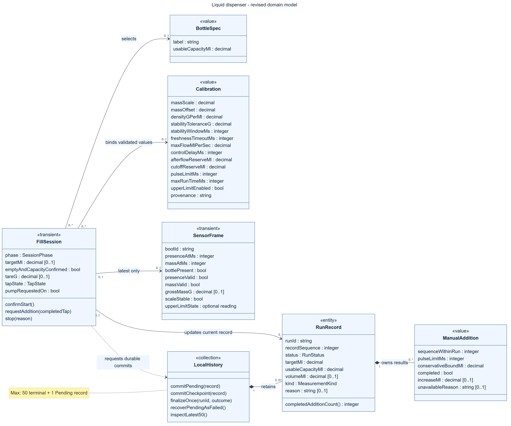

# IAP M3 - Revised Domain Model

Date: 2026-09-20. Basis: [M2 requirements](M2_REQUIREMENTS.md) at public commit `d836675660876fc5fea90688d79d65f282563501`.

[Vector image (SVG)](diagrams/M3_DOMAIN_MODEL.svg) | [Editable Mermaid source](diagrams/M3_DOMAIN_MODEL.mmd) | [First AI draft](ai/M3_DOMAIN_FIRST_DRAFT.md) | [Structural critique](M3_AI_MODEL_CRITIQUE.md)

## Scope and notation

This is a conceptual UML class diagram for a single offline dispensing device, not a database schema or an implementation class list. A class diagram fits because the domain includes temporary sensor/interaction state as well as durable records. There are seven classes. The first AI draft was saved and committed as `63ed81f` before this revision was authored. Codex assisted with the revision and critique; this is not represented as unaided student authorship.

Solid arrows are navigable associations; numbers at each end are UML multiplicities. A filled diamond denotes composition: a retained run owns its addition values, and local history owns its retained runs. The dashed arrow is a dependency, not ownership. `[0..1]` on an attribute means an optional value. `value`, `transient`, `entity`, and `collection` are explanatory stereotypes; they do not imply tables or an inheritance hierarchy. A value may be copied without acquiring an independent identity.

The enums below are attribute types, kept out of separate boxes to keep the diagram readable:

- `SessionPhase`: Entry, WaitingForBottle, AwaitingStart, AutomaticFilling, Settling, FillReview, ManualAdding, Stopped, Faulted, Recovering.
- `TapState`: Idle, Pressed, Consumed, Cancelled. Release consumes an armed press once; there is no queue of taps.
- `RunStatus`: Pending, Confirmed, Cancelled, Failed. Interrupted is Failed with reason `interrupted`.
- `MeasurementKind`: SettledFinal, LastCheckpoint, Unavailable. A last checkpoint must never be displayed as a final measurement.

No class is added for accounts, roles, permissions, patient data, a cloud service, or a generic settings/audit subsystem. Operator and developer/calibrator are actors using the device, not identities the M2 requirements say to store. GPIO drivers, LVGL widgets, files/NVS, and locking/transaction primitives are implementation choices outside this diagram.

## Class responsibilities and M2 traceability

| Class | Why it exists | M2 trace |
| --- | --- | --- |
| `FillSession` | Holds the current target, bottle preparation, tare, one-tap state, and phase. It checks authorization and keeps requested output off until all start conditions pass. Combining preparation and execution in one transient object avoids giving temporary steps independent identities. | US-01 AC1-3, US-02 AC2-3, US-04 AC1-3, US-05 AC1-3, US-06 AC1-3 |
| `BottleSpec` | A configured option with usable capacity excluding headspace. It does not identify a physical bottle or infer emptiness from a break beam. The operator selects and confirms it. | US-02 AC1, AC3 |
| `Calibration` | Validated conversion/limit values and their provenance, including density, stable/fresh measurement rules, delivery bounds, and runtime limit. Values are bound for an authorized session, not looked up through an invented persistent version registry. | US-03 AC1-3, US-04 AC3, US-05 AC1, US-06 AC3 |
| `SensorFrame` | Latest timestamped observations and validity, including optional upper-limit input. It is discarded/replaced as fresh readings arrive and is not a stored sensor-history entity. | US-02 AC2, US-04 AC2, US-05 AC1, US-06 AC3 |
| `RunRecord` | Durable run identity and outcome data. Status Pending is the pending-run marker; a terminal status is the outcome. The same identity supports one-time finalization and recovery without separate outcome/marker objects pointing to a destroyed runtime run. | US-07 AC1-3, US-08 AC1-3, NFR-03 |
| `ManualAddition` | Records an issued addition's bound, completion, and measured increase or explicit unavailability. It belongs to one run and has a sequence within that run, not a global identity or a surviving touch-gesture owner. | US-06 AC1-4, US-07 AC2 |
| `LocalHistory` | Domain collection responsible for durable pending state, one-time outcome finalization/recovery, inspection, and bounded retention. It does not prescribe a database, filesystem, or NVS layout. | US-07 AC3, US-08 AC1-2, NFR-03 |

The other NFRs are constraints on execution, not reasons to add entities. NFR-01 constrains the view/session acknowledgement path to M2's 200/500 ms bounds. NFR-02 constrains the session-to-driver off-command path to 100 ms. Storage and display work must not block that shutdown path. A diagram cannot demonstrate either timing requirement; those remain device tests.

## Relationship and lifecycle decisions

1. A `FillSession` may initially have no selected bottle, validated calibration, sensor frame, or durable run. Therefore these associations are `0..1`, not always `1`. Before Start, all required values must exist and pass validation. At most one session may authorize output on a device; the `0..*` ends on reusable bottle/configuration values describe possible reuse, not concurrent pump operations.
2. A session can update at most one `RunRecord`, and a record has at most one live session. After a session closes, the record can remain with **zero** sessions. This is an association, not composition by a transient controller.
3. `LocalHistory` owns `0..51` records with a tighter invariant: **at most 50 terminal records and at most one Pending record**. The diagram's upper bound is not permission for 51 completed outcomes. Finalizing the pending record may require evicting the oldest terminal record; the pending record is never evicted to make room.
4. Each `ManualAddition` value belongs to exactly one `RunRecord`. Its `sequenceWithinRun` is unique within that record. Values are retained with the outcome and evicted with it. `completedAdditionCount()` is derived from completed addition entries, avoiding two independent counts that can disagree.
5. A latest `SensorFrame` is transient. It contains a boot identifier and monotonic per-sensor reading times, so reboot cannot accidentally make an earlier frame look fresh. A configured upper-limit reading includes its value, validity, and timestamp; when disabled it is absent. No real-time clock is assumed.
6. `Calibration` is an immutable value for an authorized session. It carries provenance, but no requirement is inferred for a historical version table or foreign key from each saved run. Supporting calibration-version analysis later would be an explicit extension, not something M2 currently requires.

## Invariants and behavior that the diagram alone cannot show

- **Valid target and preparation:** target must be finite and positive; `targetMl <= selected usableCapacityMl`. Capacity and empty-bottle confirmation are explicit. The tare is established from stable valid readings and retained across additions. Editing target, selection, tare, or calibration invalidates authorization.
- **Ready frame:** required sensor values must be valid, from the current boot, and within configured freshness limits; bottle presence and stability must hold. Readiness is rechecked at Start and for additions. Missing or invalid calibration blocks starting.
- **Volume:** `volumeMl = (grossMassG - tareG) / densityGPerMl`. The live value is derived from the latest valid frame; the run saves only required result/checkpoint values. An unavailable value is absent with a reason, not zero. A finite, physically inconsistent sensor value must be classified by the documented sensor rules, not silently treated as valid.
- **Authorization order:** validate conditions, reserve a run ID, durably commit a Pending `RunRecord`, then request pump output. A failed initial commit blocks output. A pending record is not a successful outcome.
- **Conservative additions:** `boundMl = maxFlowMlPerSec * ((pulseMs + controlDelayMs) / 1000) + afterflowReserveMl`. The pulse must meet `pulseMs <= pulseLimitMs`, and the bound must fit below both remaining requested volume and remaining usable capacity. The automatic cutoff has its own calibrated reserve.
- **Tap semantics:** only one completed, noncancelled press/release in an eligible review state may issue an addition. A hold never repeats, release outside/cancellation issues none, and taps while pumping are discarded. An issued addition is counted as completed once its bounded action completes; a fault during it leaves it incomplete with available diagnostic data. Returning to review never queues an earlier tap.
- **Shutdown and review:** Stop/Cancel, absent bottle, invalid/stale required input, configured upper limit, and runtime expiry request output off before any logging/UI acknowledgement work. Stop/fault recovery requires a fresh cycle and confirmation. Automatic cutoff enters settling and review; it does not itself create Confirmed status.
- **Durable recovery:** reboot initializes requested output off. A retained Pending record is finalized under the same `runId` as Failed/interrupted, with LastCheckpoint or Unavailable measurement kind. If it is already terminal, recovery does not append or overwrite another outcome. At no point may a checkpoint masquerade as the last physical reading or a finished volume.
- **Commit semantics:** finalization and oldest-record eviction must preserve the last acknowledged retained data across power loss. A backend must provide atomic/recoverable writes and stable ID/sequence allocation. Merely placing both states in one object does not establish durability. M2's power-interruption tests remain mandatory.
- **Unavailable addition measurement:** the action can be recorded as completed with unavailable increase, as US-06 AC4 allows. If the cause is a required-sensor fault, US-05 still takes the session to Faulted and prevents another addition; record completeness does not override an interlock.

## Decisions deliberately left open

Bottle sizes/headspace, density, conversion calibration, stability/freshness limits, cutoff/afterflow reserves, pulse duration, exact maximum-runtime semantics, and the storage backend still need integration decisions. Runtime semantics must cover manual additions as well as initial filling. `recordSequence` is a proposed monotonic ordering mechanism for oldest-first retention; it is not a claim that a wall-clock timestamp exists.

The minimum recovery checkpoint retains target, capacity, available measured checkpoint, and acknowledged addition entries/counts. The precise checkpoint schedule is unresolved; unsaved live samples may be lost under M2, and recovered quantities must be labelled accordingly. No unbounded raw sensor trace is required. Storage sizing for the maximum supported addition count per run also needs a documented limit or compact representation; `0..*` expresses logical multiplicity, not unlimited ESP32 memory.

Pre-start cancellation creates no pump run; whether such an abandoned request warrants a separate record remains an open clarification from M2. This model assumes no outcome for it and makes that choice explicit. All completed/failed/cancelled authorized runs are recorded. Electrical default-off behavior, board revision, wiring, pump coast, and gravity flow remain physical validation gates, not facts proven by the diagram.
