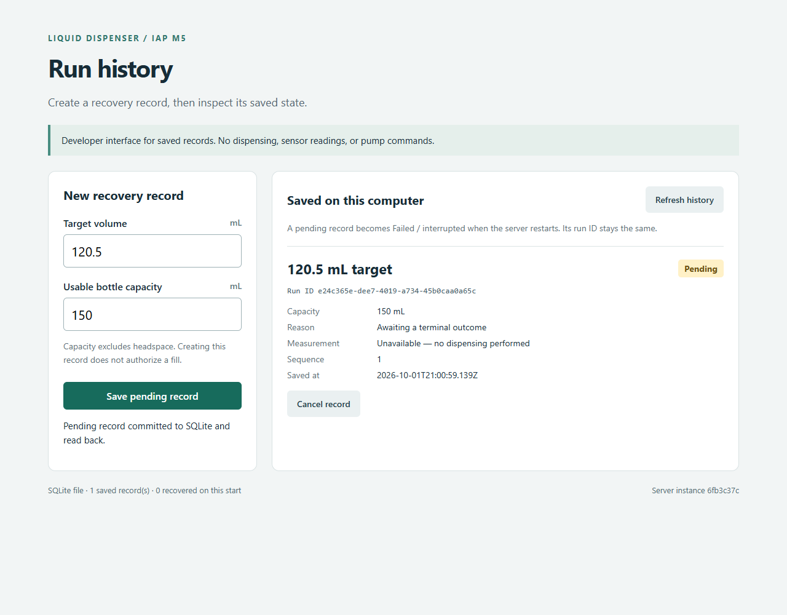
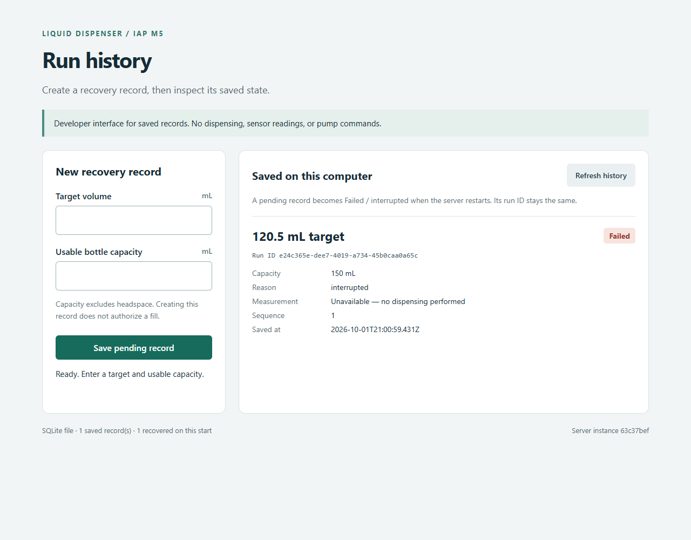
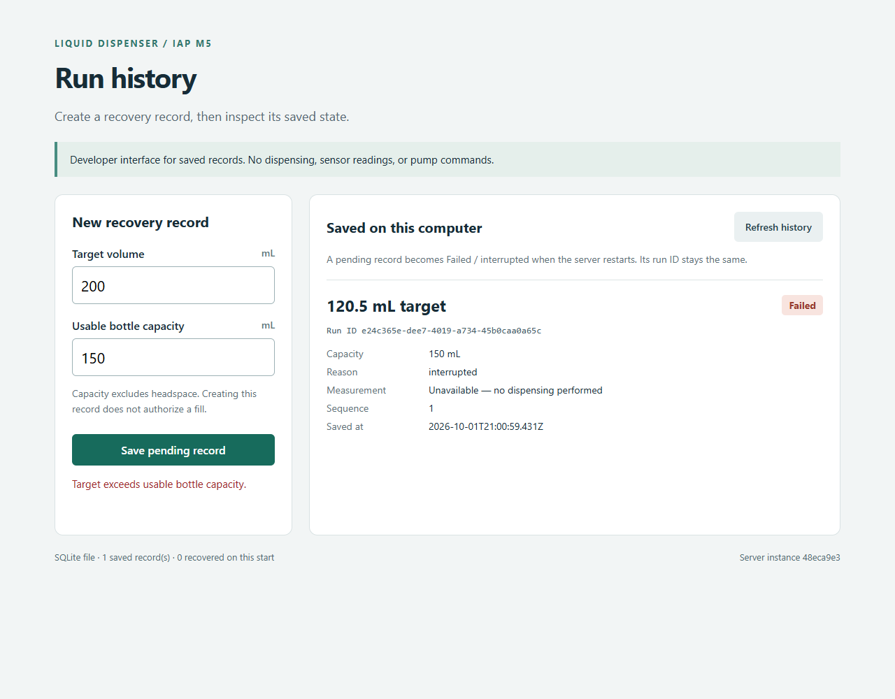
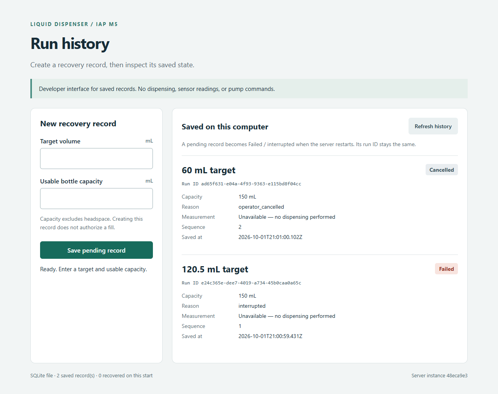

# IAP M5 - Walking Skeleton

Repository: **https://github.com/treybarrett1/liquid-dispensing-iap**

## The working slice

**Browser -> HTTP endpoint -> run-history rules -> real SQLite file -> committed-row readback -> browser.** This exercises M2's local-history/recovery concepts and ADR-001's stable run identity through a desktop developer interface. It is record lifecycle, not a simulated physical fill. [ADR-002](adr/ADR-002-desktop-storage-slice.md) explains the desktop adapter and the embedded integration still unproven.

The operator supplies a target and usable capacity. The server validates both, rejects over-capacity targets, commits a Pending record, and reads it back. Cancellation changes the same row to Cancelled. Restart recovers Pending to Failed/interrupted under the same ID; another restart adds no duplicate. Measurements remain unavailable because this slice never dispenses liquid. The latest 50 terminal records plus one pending record are retained.

## Evidence: actual browser captures

These screenshots were captured by the browser test from the built app on October 1, 2026. They are not mockups or edited images. The test independently queries the real SQLite file; [evidence.json](evidence/m5/evidence.json) records observed IDs and row values.

### 1. Input committed and read back

Target **120.5 mL**, capacity **150 mL**, status **Pending**. The form and saved row show the request/result. The test then reloads and verifies persistence again.



### 2. Real server process killed and restarted

The run ID and target are unchanged; status becomes **Failed**, reason **interrupted**. The server instance in the footer changes. A second process restart verifies zero further recoveries and no duplicate row.



### 3. Invalid request rejected

A 200 mL target against 150 mL capacity returns a domain error and adds no row.



### 4. Cancellation survives page reload

A valid 60 mL record is cancelled, and its terminal state is read back after reload.



## CI and reproduction

The [CI workflow](../.github/workflows/ci.yml) installs locked dependencies, **builds the production server and browser**, runs calculator/real-SQLite tests, installs Chromium, and runs browser/process-restart tests against the built server. It uploads `m5-browser-evidence` for 30 days. Screenshots above are committed so they remain available after artifact expiration.

The exact successful CI run link will be recorded here after the first remote run completes. A configured workflow alone is not claimed as a green run.

Local results: production build passed; **23 tests** passed (12 original calculator, 11 SQLite/domain); **2 end-to-end tests** passed. Database tests cover invalid values, same-ID recovery, duplicate prevention, terminal protection, retention, and an actual SQLite write failure under query-only mode.

With Node.js 24, from a clean checkout:

```sh
npm ci
npm run build
npm test
npx playwright install chromium
npm run test:e2e
npm start
```

Open http://127.0.0.1:5173. Save a pending record, stop/restart the server retaining `data/dispenser.sqlite`, then refresh. Tests use temporary databases and do not erase application history. The local capture used installed Chromium through `PLAYWRIGHT_CHROMIUM_EXECUTABLE`; CI installs the browser expected by the locked Playwright version.

## Rubric map and limits

| Criterion | Points | Evidence |
| --- | --- | --- |
| Genuine end-to-end path | 7 | Form/request/domain/SQLite/readback, direct database queries, actual process restarts, and screenshots. |
| CI configured and green run linked | 6 | Committed workflow; exact successful run added after verification. |
| Meaningful build and tests | 4 | Esbuild production build, 23 calculator/database tests, and 2 end-to-end tests using real storage. |
| Legible captures and prompt-and-diff log | 3 | Four screenshots, observed evidence JSON, and [AI_LOG.md](../AI_LOG.md). |

No browser localStorage, mocked repository, canned success response, simulated sensor readings, or pump commands are used. This proves the **desktop** slice's layers. It does not prove ESP32/LVGL/Arduino/device-storage integration, electrical power-loss durability, or physical dispensing. Those need board integration and hardware evidence. The full private app remains separate. This package is not a course-site submission.
