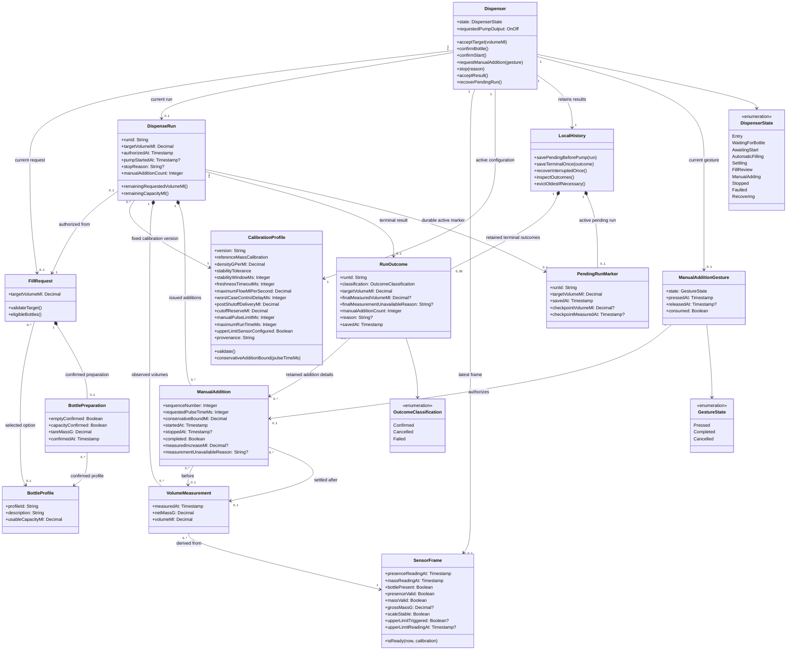

This model treats a **dispense run** as the central domain entity. Bottle preparation, calibrated measurements, bounded manual additions, and the retained outcome belong to that run. A dispenser coordinator applies the authorization and stopping rules. Screens, ESP32 drivers, and storage technology remain implementation details.

`?` denotes an optional value. Missing measurements carry an explicit unavailable status or reason; they are never represented by a fabricated zero. The diagram describes domain relationships, not a requirement to retain every sensor frame or measurement permanently.

**Classes and relationships**

- **Dispenser** coordinates one current request and at most one current run. Its state governs permitted actions, and its requested pump output defaults to off. Pump authorization is temporary and must be re-established after stopping, fault recovery, or reset.
- **FillRequest** contains a finite positive target. It can exist without a selected bottle or completed preparation. Each request can authorize at most one run; a subsequent cycle requires a new request and confirmation.
- **BottleProfile** describes a configured bottle option and its calibrated usable capacity, including the headspace exclusion. Many requests may select the same profile. It does not represent automatic identification of a physical bottle.
- **BottlePreparation** records the operator’s empty-bottle and capacity confirmation and the established tare. A request has zero or one preparation; an authorized run requires exactly one through its request.
- **CalibrationProfile** contains the measured conversion parameters, operational limits, and provenance. Many runs can use one version. A run uses a fixed version so its volume and delivery decisions remain interpretable.
- **SensorFrame** contains separately timestamped sensor readings and their validity. The dispenser has at most one latest frame. **VolumeMeasurement** represents a valid estimate derived from a frame, the run’s tare, and its calibration:  
  `volumeMl = (grossMassG − tareMassG) / densityGPerMl`.
- **DispenseRun** groups the authorized fill and zero or more manual additions. It has zero or one terminal outcome and, while pending, one durable marker. Its measurements support progress, cutoff decisions, review, and final-volume reporting.
- **ManualAdditionGesture** separates a completed tap from a held or abandoned press. Each gesture authorizes at most one **ManualAddition**. Each issued addition records its conservative bound, completion status, and measured increase when available. Optional before/after measurement links allow an unavailable increase to remain explicit.
- **RunOutcome** is the retained terminal record. It preserves addition details and classifies the run as confirmed, cancelled, or failed; interruption is a failed outcome with an interruption reason.
- **LocalHistory** retains at most 50 terminal outcomes and one pending marker. Run identifiers support saving and recovery exactly once. A **PendingRunMarker** contains recovery information; its optional saved volume is a checkpoint, never automatically a final measurement.

**Rules that accompany the diagram**

1. Accepting a target never enables output. Bottle selection requires `usableCapacityMl >= targetVolumeMl`; presence does not establish capacity or emptiness.
2. Start requires valid configuration, confirmed bottle preparation, a fresh ready sensor frame, explicit Start confirmation, and a successfully committed pending marker. Failure of any condition leaves output off.
3. Automatic filling stops at the conservative cutoff and enters settling. A settled valid measurement permits review; only explicit acceptance produces a confirmed outcome.
4. A manual addition is permitted only during underfill review with valid interlocks. Its bound is:

   `maximumFlowMlPerSecond × (pulseTimeSeconds + worstCaseControlDelaySeconds) + postShutoffDeliveryMl`

   The bound must fit within both remaining requested volume and remaining usable capacity. The pulse duration must also satisfy the configured manual-pulse limit.
5. Held gestures do not repeat. Cancelled gestures issue nothing. Gestures received while adding are discarded, and a consumed gesture cannot authorize another addition. A completed addition increments the count once; an unavailable measured increase remains unavailable.
6. Stop/Cancel, bottle removal, invalid or stale required sensors, maximum run time, and a triggered configured upper-limit sensor command output off and retain the reason. Recovery of readings or a held button cannot restart pumping.
7. A terminal outcome is saved once per run identifier. Recovery converts a pending run into one failed/interrupted outcome and leaves output off. Terminal-save and marker-retirement behavior must prevent duplicate recovery records.
8. A pump-off command describes controller output. It does not assert that motor coast or gravity-driven liquid flow has ceased.

**Requirement mapping**

| M2 identifier | Model elements and responsibilities |
|---|---|
| US-01 AC1–AC3 | `FillRequest.targetVolumeMl`, target validation, and `Dispenser.Entry`/`WaitingForBottle`. Digit editing, Delete, Enter, units, and explanatory messages belong to the presentation layer. |
| US-02 AC1–AC3 | `BottleProfile`, `BottlePreparation`, `SensorFrame.isReady()`, and start-confirmation state. Eligibility checks capacity; operator confirmation establishes the selected capacity and empty-bottle assumption before tare. |
| US-03 AC1–AC3 | `CalibrationProfile`, its validation/provenance, and `VolumeMeasurement`. Measured flow bounds are distinct from nominal pump specifications. |
| US-04 AC1–AC3 | `confirmStart()`, `DispenseRun`, measured progress, conservative cutoff, `Settling`, and `FillReview`. Pre-start cancellation returns to entry without pumping. |
| US-05 AC1–AC3 | `stop(reason)`, sensor/configuration interlocks, run-time limit, default-off initialization, and fresh authorization after stopping or faults. |
| US-06 AC1–AC4 | `ManualAdditionGesture`, `ManualAddition`, conservative bound checks, discarded overlapping taps, settled measurements, and exactly-once addition counting. |
| US-07 AC1–AC3 | `RunOutcome`, retained addition details, explicit unavailable values, unique run identifier, and `LocalHistory.saveTerminalOnce()`/inspection. |
| US-08 AC1–AC3 | `PendingRunMarker`, durable save before pumping, interruption recovery, checkpoint labeling, and a new request/readiness/confirmation sequence. |
| NFR-01 | Presentation and coordinator implementations must meet the specified 200/500 ms acknowledgement thresholds on the target device. Class structure alone cannot establish compliance. |
| NFR-02 | The coordinator-to-driver shutdown path must meet the 100 ms off-command bound during automatic and manual pumping, independently of display and history work. |
| NFR-03 | `LocalHistory` supports offline inspection, latest-50 retention, one durable pending marker, oldest-only eviction, and exactly-once interruption recovery across the specified power tests. |

**Assumptions and unresolved questions**

- One dispenser serves one bottle and one active run at a time. User accounts and authenticated operator/calibrator identities are unnecessary within this scope.
- Bottle preparation and calibration are treated as fixed for an authorized run. Editing the target, bottle selection, tare, or calibration invalidates preparation and requires renewed checks and confirmation.
- The diagram permits a completed manual addition with an unavailable measured increase, reflecting US-06 AC4. The exact transition from unavailable measurement to review versus failed outcome needs clarification; a required sensor fault must still invoke US-05.
- The specified maximum run time needs an exact definition: elapsed time since Start, cumulative pump-on time, or another documented basis that also covers manual additions.
- Pre-start cancellation is assumed not to create a dispense outcome. Faults after authorization produce failed records; classification and logging of faults before an authorized run remain to be decided.
- Recovery must preserve already acknowledged information, but the checkpoint schema and checkpoint frequency are unspecified. The marker may need additional saved addition details to meet the intended recovery-history fidelity.
- Stability thresholds, freshness timeouts, supported capacities, tare procedure, density, flow limits, cutoff reserve, manual-pulse duration, settling conditions, and runtime limits remain unvalidated configuration decisions.
- Physical bottle fit, exact PCB revision, sensor wiring/levels, driver default-off behavior, coast, and gravity flow remain separate integration and release questions. This model provides no physical validation evidence.
